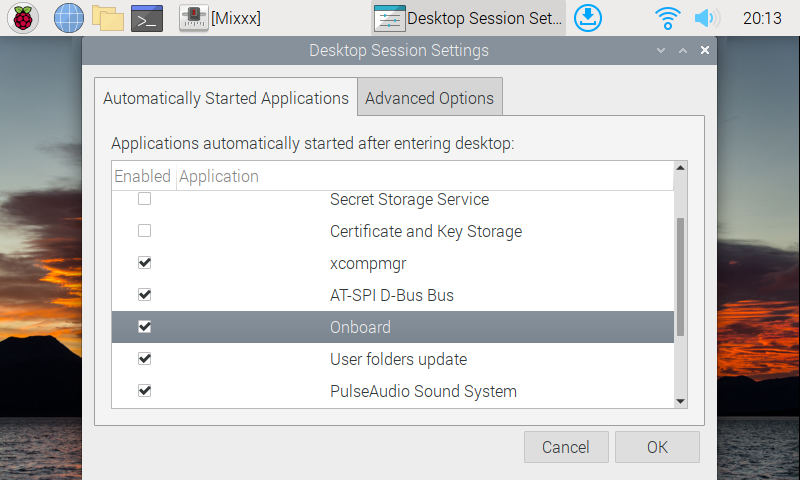
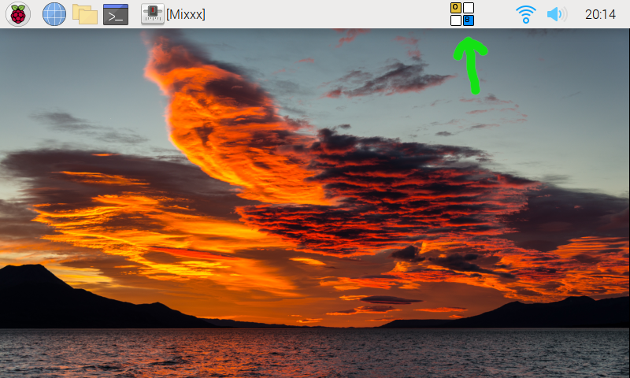
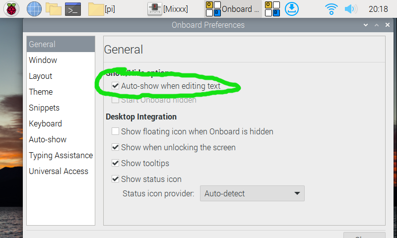
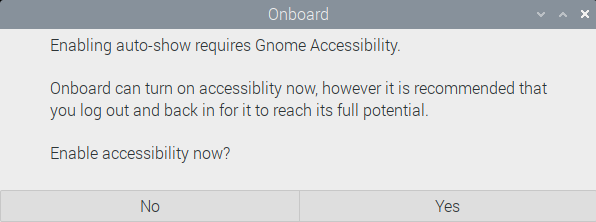
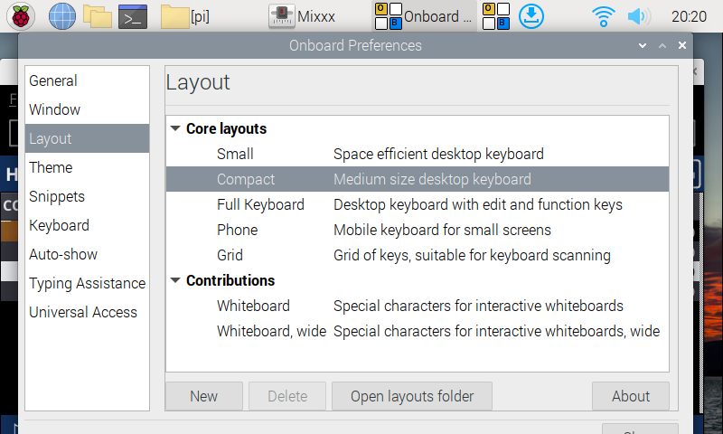
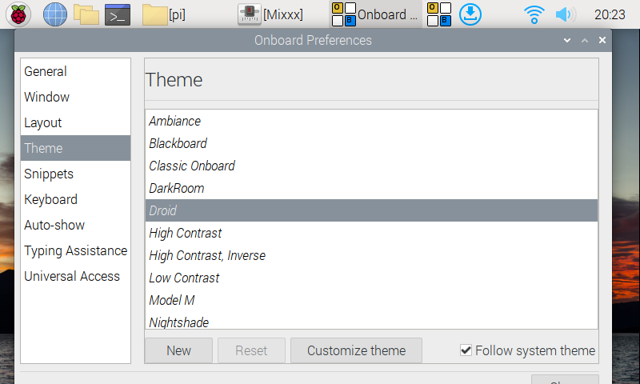
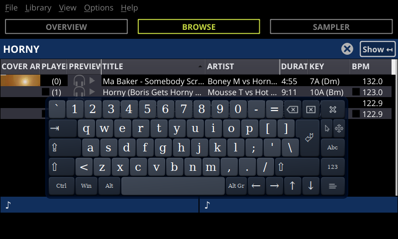

Pioneer inspired theme for smaller screen resolutions. It has been designed to 'extend' a MIDI controller.
Designed for use with the DDJ-400 with Raspberry Pi standalone mod ([link](https://www.youtube.com/watch?v=kyrJW7Vaf68)).

## Screenshot

## Features
* Tabbed view: Overview, Browse and Samples
* Fully scalable with a minimum resolution of 480x360 (!)
* Inspired by the Pioneer XDJ interface
* Small waveform overviews at the bottom
* Barely any resources = Small footprint!

## Install
Drop the `Pioneered` folder in `<MIXXX_FOLDER>/skins` and select it from `Preferences > Interface`.

Alternatively, you can use the `install.linux.sh` script to automatically install the skin to `.mixxx/skins`.

## Optional: set up on-screen keyboard
It can be useful to have a virtual keyboard to search songs using the touchscreen. For this, we will use the `onboard` Linux package:

`sudo apt install onboard at-spi2-core`

First, configure your OS to run `onboard` at startup. In Raspbian/Raspberry Pi OS, this is done in the Raspbian menu `Preferences > Desktop Session Settings`, and in the tab `Automatically Started Applications`, enable `Onboard` like in the screenshot below:

Either restart the Raspberry Pi or start manually `onboard` from the Raspbian menu `Universal Access > Onboard`. Onboard should become visible in the top system bar like in the screenshot below:

Start the `onboard` configuration tool, by either clicking on the `onboard` logo in the top bar or from the Raspbian menu `Preferences > Onboard Settings`.
Select the option "Auto-show when editing text" (highlighted in green in the screenshot below). This will automatically open the on-screen keyboard when a text field is in focus, for instance in the Mixxx library.

Activating the "Auto-show" option might pop up the following dialog asking to turn on Gnome Accessibility, press `Yes`.

In the `onboard` preferences, go to the `Layout` category and make sure the `Compact` layout is enabled, as shown in screenshot below.

In the `onboard` preferences, go to the `Theme` category and select your preferred theme. The screenshot below uses the `droid` theme.

Finally, quit the `onboard` preferences. `onboard` should still be running in the background, with its logo visible in the top bar. Go to `mixxx` and press on the library search field. The on-screen keyboard should appear as shown in the screenshot below.

## Contributors
* [timewasternl](https://github.com/timewasternl)
* [GorgiAstro](https://github.com/GorgiAstro)
* [BvOBart](https://github.com/bvobart)
* [bencejuhaasz](https://github.com/bencejuhaasz)
